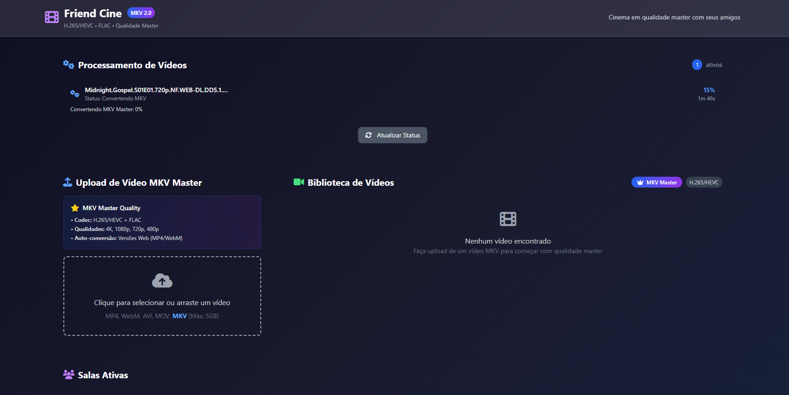

# 🎬 Friend Cine

Uma plataforma colaborativa moderna para assistir filmes em conjunto online, construída com **Astro**, **Express.js** e **Socket.io**.

[](https://github.com/Br3n0k/friend-cine/blob/main/LICENSE)
[](https://nodejs.org/)
[](https://github.com/Br3n0k/friend-cine/issues)

## ✨ Principais Funcionalidades

- 🎥 **Player Avançado** - Video.js com suporte a múltiplas faixas de áudio e legendas
- 🔄 **Sincronização em Tempo Real** - Assistir junto com amigos usando WebSockets
- 💬 **Chat Integrado** - Conversas durante o filme
- 📁 **Upload Inteligente** - Conversão automática com FFmpeg
- 🏠 **Salas Dinâmicas** - Criar e gerenciar salas privadas
- 🔒 **Segurança Robusta** - Rate limiting, validação e sanitização
- 📱 **Design Responsivo** - Interface moderna com Tailwind CSS

## 🚀 Início Rápido

### Método Automático

**Windows:**
```bash
start.bat
```

**Linux/Mac:**
```bash
chmod +x start.sh && ./start.sh
```

### Método Manual

1. **Clone o repositório:**
```bash
git clone https://github.com/Br3n0k/friend-cine.git
cd friend-cine
```

2. **Instale as dependências:**
```bash
npm install
```

3. **Configure as variáveis de ambiente:**
```bash
cp .env.example .env
# Edite o arquivo .env conforme necessário
```

4. **Execute a aplicação:**
```bash
npm run dev:all
```

5. **Acesse:**
   - **Frontend:** http://localhost:3000
   - **Backend API:** http://localhost:4000

## 🛠️ Tecnologias

### Frontend
- **Astro** - Framework moderno
- **Tailwind CSS** - Estilização utilitária
- **Video.js** - Player de vídeo robusto
- **Socket.io Client** - Comunicação em tempo real

### Backend
- **Express.js** - Servidor web
- **Socket.io** - WebSockets
- **Multer** - Upload de arquivos
- **FFmpeg** - Processamento de vídeo
- **Winston** - Sistema de logs

### Segurança
- **express-rate-limit** - Rate limiting
- **Helmet** - Headers de segurança
- **Validação personalizada** - Sanitização de dados

## 📁 Estrutura do Projeto

```
friend-cine/
├── src/
│   ├── components/          # Componentes reutilizáveis
│   ├── layouts/            # Layouts Astro
│   ├── pages/              # Páginas da aplicação
│   └── utils/              # Utilitários e helpers
├── server/
│   ├── middleware/         # Middleware de segurança
│   ├── index.js           # Servidor principal
│   └── video-converter.js # Processamento de vídeo
├── public/
│   ├── videos/            # Pasta de vídeos
│   └── subtitles/         # Pasta de legendas
└── logs/                  # Logs da aplicação
```

## 🎯 Como Usar

### 1. Upload de Vídeos
- Arraste arquivos para a área de upload
- Conversão automática para formatos web
- Suporte: MP4, WebM, AVI, MOV, MKV, WMV, FLV

### 2. Criar uma Sala
- Selecione um vídeo
- Digite nome da sala e seu usuário
- Compartilhe o link com amigos

### 3. Assistir Juntos
- Controles sincronizados automaticamente
- Chat em tempo real
- Múltiplas faixas de áudio e legendas

## ⚙️ Configuração Avançada

### Variáveis de Ambiente

Copie `.env.example` para `.env` e configure:

```bash
# Servidor
PORT=4000
NODE_ENV=development

# URLs
FRONTEND_URL=http://localhost:3000
BACKEND_URL=http://localhost:4000

# Upload
MAX_FILE_SIZE=2147483648
UPLOAD_PATH=./public/videos

# Rate Limiting
RATE_LIMIT_WINDOW_MS=900000
RATE_LIMIT_MAX_REQUESTS=100
```

### FFmpeg (Conversão de Vídeo)

**Instalação automática:**
```bash
npm run install-ffmpeg
```

**Verificar instalação:**
```bash
npm run check-ffmpeg
```

## 🐳 Docker

```bash
# Build
docker build -t friend-cine .

# Run
docker run -p 3000:3000 -p 4000:4000 friend-cine
```

## 📝 Scripts Disponíveis

| Comando | Descrição |
|---------|-----------|
| `npm run dev:all` | Inicia frontend + backend |
| `npm run dev` | Apenas frontend (Astro) |
| `npm run dev:server` | Apenas backend |
| `npm run build` | Build de produção |
| `npm run test-system` | Teste do sistema |
| `npm run install-ffmpeg` | Instalar FFmpeg |

## 🔒 Segurança

- ✅ Rate limiting para uploads e API
- ✅ Validação e sanitização de entrada
- ✅ Headers de segurança (CSP, HSTS, etc.)
- ✅ Proteção contra XSS e injeção
- ✅ Logs de segurança estruturados

## 🚨 Resolução de Problemas

### Vídeo não carrega
- Verifique se o arquivo está em `public/videos/`
- Confirme que o formato é suportado
- Verifique logs em `logs/error.log`

### Problemas de sincronização
- Verifique conexão WebSocket no console
- Recarregue a página
- Verifique se o backend está rodando

### Upload falhando
- Verifique tamanho do arquivo (máx 2GB)
- Confirme formato suportado
- Verifique permissões da pasta

## 🤝 Contribuindo

1. Fork o projeto
2. Crie uma branch para sua feature (`git checkout -b feature/AmazingFeature`)
3. Commit suas mudanças (`git commit -m 'Add some AmazingFeature'`)
4. Push para a branch (`git push origin feature/AmazingFeature`)
5. Abra um Pull Request

## 📄 Licença

Este projeto está licenciado sob a MIT License - veja o arquivo [LICENSE](LICENSE) para detalhes.

## 🌟 Roadmap

- [ ] Autenticação de usuários
- [ ] Salas privadas com senha
- [ ] Playlist de vídeos
- [ ] API REST documentada
- [ ] Temas personalizáveis
- [ ] Integração com serviços de streaming
- [ ] Chat por voz
- [ ] Mobile app

## 📞 Suporte

- 📧 Email: [Issues](https://github.com/Br3n0k/friend-cine/issues)
- 📝 Documentação: [Wiki](https://github.com/Br3n0k/friend-cine/wiki)
- 🐛 Bug reports: [Issues](https://github.com/Br3n0k/friend-cine/issues/new)

---

**Desenvolvido com ❤️ por [Br3n0k](https://github.com/Br3n0k) para assistir filmes com amigos!**