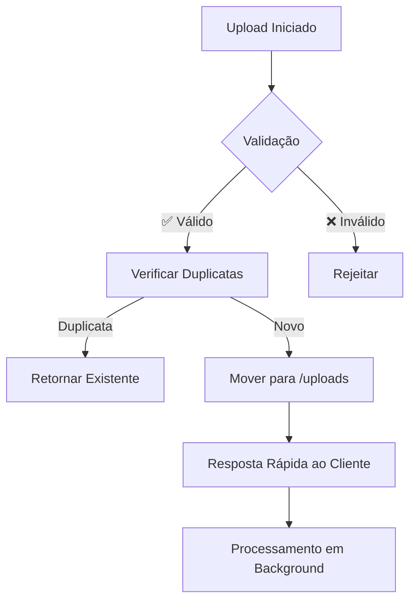
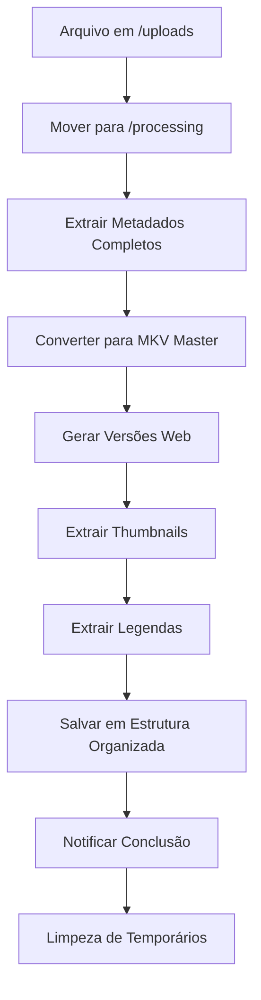

# 🎬 **FLUXO MKV - SISTEMA DE ARQUIVOS REFATORADO**

## 📊 **VISÃO GERAL DO SISTEMA**

O **Friend Cine** foi completamente refatorado para utilizar **MKV** como formato principal, oferecendo:

- ✅ **Qualidade Superior**: H.265/HEVC para máxima compressão sem perda de qualidade
- ✅ **Múltiplas Trilhas de Áudio**: Suporte nativo a múltiplos idiomas
- ✅ **Legendas Internas**: Legendas integradas no container MKV
- ✅ **Capítulos**: Navegação avançada dentro do vídeo
- ✅ **Metadados Ricos**: Informações completas sobre o conteúdo
- ✅ **Versões Web**: Conversão automática para compatibilidade com navegadores

---

## 🏗️ **ARQUITETURA DO SISTEMA**

### **📁 Estrutura de Diretórios**

```
storage/
├── uploads/           # 📥 Uploads temporários
├── processing/        # ⚙️ Arquivos sendo processados
├── masters/           # 🎯 Arquivos MKV principais
│   ├── 4k/           # 🖥️ Ultra HD (3840x2160)
│   ├── 1080p/        # 📺 Full HD (1920x1080)
│   ├── 720p/         # 📱 HD (1280x720)
│   └── 480p/         # 📱 SD (854x480)
├── web/               # 🌐 Versões para streaming
│   ├── mp4/          # 📹 MP4 universal
│   ├── webm/         # 🔄 WebM moderno
│   └── mobile/       # 📱 Otimizado para móveis
├── subtitles/         # 📝 Legendas extraídas
│   ├── pt/           # 🇧🇷 Português
│   ├── en/           # 🇺🇸 Inglês
│   ├── es/           # 🇪🇸 Espanhol
│   ├── fr/           # 🇫🇷 Francês
│   └── auto-generated/ # 🤖 Geradas automaticamente
├── thumbnails/        # 🖼️ Miniaturas
│   ├── small/        # 320x180
│   ├── medium/       # 640x360
│   ├── large/        # 1280x720
│   └── poster/       # 1920x1080
├── metadata/          # 📊 Metadados extraídos
└── temp/             # 🗑️ Arquivos temporários
    ├── daily/        # Limpeza diária
    ├── processing/   # Processamento ativo
    └── failed/       # Falhas de conversão
```

---

## 🔄 **FLUXO DE PROCESSAMENTO**

### **1. 📤 Upload**


### **2. ⚙️ Processamento**


### **3. 🎯 Conversão MKV Master**
```bash
# Comando FFmpeg otimizado para MKV
ffmpeg -i input.mkv \
  -c:v libx265 \           # Codec H.265 para vídeo
  -crf 18 \                # Qualidade visual sem perdas
  -preset medium \         # Balanço velocidade/qualidade
  -c:a flac \             # Áudio sem perdas
  -map 0:v:0 \            # Mapear vídeo
  -map 0:a \              # Mapear TODAS as trilhas de áudio
  -map 0:s \              # Mapear TODAS as legendas
  -map_chapters 0 \       # Preservar capítulos
  -metadata title="Título" \
  output_master.mkv
```

### **4. 🌐 Conversão Web**
```bash
# MP4 para compatibilidade universal
ffmpeg -i master.mkv \
  -c:v libx264 \
  -crf 21 \
  -preset fast \
  -c:a aac -b:a 320k \
  -map 0:v:0 -map 0:a:0 \  # Primeira trilha de áudio
  output_1080p.mp4

# WebM para navegadores modernos
ffmpeg -i master.mkv \
  -c:v libvpx-vp9 \
  -crf 23 \
  -c:a libopus -b:a 192k \
  output_1080p.webm
```

---

## 🎛️ **CONFIGURAÇÕES DE QUALIDADE**

### **📊 Perfis de Qualidade**

| Qualidade | Resolução | Bitrate Vídeo | Codec | Uso |
|-----------|-----------|---------------|-------|-----|
| **4K Master** | 3840x2160 | 15000k | H.265 | Arquivo principal |
| **1080p Master** | 1920x1080 | 8000k | H.265 | Padrão alta qualidade |
| **1080p Web** | 1920x1080 | 5000k | H.264 | Streaming web |
| **720p Web** | 1280x720 | 3000k | H.264 | Compatibilidade |
| **720p Mobile** | 1280x720 | 2000k | H.264 | Dispositivos móveis |

### **🎵 Configurações de Áudio**

| Tipo | Codec | Bitrate | Canais | Uso |
|------|-------|---------|--------|-----|
| **Master** | FLAC | 1411k | Original | Qualidade máxima |
| **Web High** | AAC | 320k | Stereo | Streaming premium |
| **Web Standard** | AAC | 256k | Stereo | Streaming padrão |
| **Mobile** | AAC | 128k | Stereo | Dispositivos móveis |

---

## 🔧 **APIs REFATORADAS**

### **📋 Listar Vídeos**
```javascript
GET /api/videos?quality=web&page=1&limit=20&sort=date

Response:
{
  "videos": [{
    "id": "1234567890_abcdef_xyz123",
    "name": "filme-exemplo.mkv",
    "title": "Filme de Exemplo",
    "duration": 7200,
    "resolution": "1920x1080",
    "audioTracks": 3,
    "audioLanguages": ["pt", "en", "es"],
    "subtitleTracks": 2,
    "subtitleLanguages": ["pt", "en"],
    "versions": {
      "master": {
        "url": "/videos/1234567890_abcdef_xyz123_master.mkv",
        "format": "mkv",
        "quality": "master"
      },
      "web": [{
        "url": "/videos/1234567890_abcdef_xyz123_1080p.mp4",
        "format": "mp4",
        "quality": "1080p"
      }]
    },
    "thumbnails": [{
      "size": "large",
      "url": "/thumbnails/large/1234567890_abcdef_xyz123_large.jpg"
    }],
    "hasMultipleAudio": true,
    "hasSubtitles": true
  }],
  "pagination": {
    "current": 1,
    "total": 50,
    "pages": 3
  }
}
```

### **📤 Upload de Vídeo**
```javascript
POST /api/upload
Content-Type: multipart/form-data

Response (Imediata):
{
  "success": true,
  "fileId": "1234567890_abcdef_xyz123",
  "originalName": "filme.mkv",
  "size": 2147483648,
  "status": "uploaded",
  "message": "🎬 Upload concluído! Iniciando processamento...",
  "estimatedProcessingTime": "15 minutos"
}

// WebSocket notifications
{
  "event": "video-processed",
  "data": {
    "fileId": "1234567890_abcdef_xyz123",
    "success": true,
    "webVersions": [...],
    "thumbnails": [...],
    "metadata": {...}
  }
}
```

### **🔍 Detalhes do Vídeo**
```javascript
GET /api/video/1234567890_abcdef_xyz123

Response:
{
  "id": "1234567890_abcdef_xyz123",
  "name": "filme.mkv",
  "metadata": {
    "video": {
      "codec": "hevc",
      "width": 1920,
      "height": 1080,
      "frameRate": 23.976,
      "duration": 7200
    },
    "audio": [{
      "index": 0,
      "codec": "flac",
      "language": "por",
      "title": "Português",
      "channels": 6,
      "bitrate": 1411000
    }],
    "subtitles": [{
      "index": 0,
      "language": "por",
      "title": "Português",
      "forced": false,
      "default": true
    }],
    "chapters": [{
      "start_time": 0,
      "end_time": 600,
      "title": "Abertura"
    }]
  }
}
```

---

## 🎮 **INTEGRAÇÃO COM FRONTEND**

### **🎬 Player de Vídeo Atualizado**
```javascript
// Video.js configurado para MKV
const player = videojs('video-player', {
  controls: true,
  responsive: true,
  fluid: true,
  sources: [{
    src: '/videos/arquivo_1080p.mp4',
    type: 'video/mp4',
    label: '1080p MP4'
  }, {
    src: '/videos/arquivo_1080p.webm',
    type: 'video/webm',
    label: '1080p WebM'
  }],
  tracks: [{
    kind: 'subtitles',
    src: '/subtitles/pt/arquivo_pt.srt',
    srclang: 'pt',
    label: 'Português',
    default: true
  }, {
    kind: 'subtitles',
    src: '/subtitles/en/arquivo_en.srt',
    srclang: 'en',
    label: 'English'
  }]
});

// Seletor de qualidade
player.ready(() => {
  player.qualityMenuButton();
});

// Seletor de áudio (quando suportado)
player.ready(() => {
  player.audioTrackMenuButton();
});
```

### **📊 Interface de Upload**
```javascript
// Upload com progress e preview
const uploadVideo = async (file) => {
  const formData = new FormData();
  formData.append('video', file);
  
  const response = await fetch('/api/upload', {
    method: 'POST',
    body: formData
  });
  
  const result = await response.json();
  
  if (result.isDuplicate) {
    showMessage(`Arquivo já existe: ${result.existingFileId}`);
    return;
  }
  
  showMessage(`Upload iniciado! ID: ${result.fileId}`);
  
  // Escutar progresso via WebSocket
  socket.on('video-processed', (data) => {
    if (data.fileId === result.fileId) {
      showMessage('🎉 Processamento concluído!');
      refreshVideoList();
    }
  });
};
```

---

## 🔒 **SEGURANÇA E VALIDAÇÃO**

### **🛡️ Validações Implementadas**

1. **Upload**:
   - Tipo de arquivo (extensão + magic bytes)
   - Tamanho máximo (5GB)
   - Verificação de integridade
   - Detecção de duplicatas (SHA256)

2. **Processamento**:
   - Validação FFmpeg
   - Verificação de corrupção
   - Sanitização de metadados
   - Rate limiting por IP

3. **Acesso**:
   - Links simbólicos seguros
   - Headers de segurança
   - CORS configurado
   - Logs de acesso

### **🚨 Rate Limiting**

- **Upload**: 5 arquivos por 15 minutos
- **API**: 100 requests por 15 minutos
- **Chat**: 30 mensagens por minuto
- **Conversão**: 2 jobs simultâneos

---

## 📈 **MONITORAMENTO E LOGS**

### **📊 Métricas Coletadas**

- Tempo de upload por arquivo
- Tempo de conversão por qualidade
- Taxa de sucesso/falha
- Uso de armazenamento
- Performance do FFmpeg

### **📋 Logs Estruturados**

```json
{
  "timestamp": "2024-01-15T10:30:00Z",
  "level": "info",
  "category": "video_conversion",
  "message": "Conversão MKV concluída",
  "data": {
    "fileId": "1234567890_abcdef_xyz123",
    "originalName": "filme.mkv",
    "inputSize": 2147483648,
    "outputSize": 1073741824,
    "compressionRatio": 0.5,
    "processingTime": 900000,
    "quality": "1080p",
    "audioTracks": 3,
    "subtitleTracks": 2
  }
}
```

---

## 🧹 **LIMPEZA E MANUTENÇÃO**

### **🔄 Processos Automáticos**

1. **Limpeza Diária**:
   - Arquivos temporários > 24h
   - Uploads órfãos > 2h
   - Logs antigos > 30 dias

2. **Limpeza Semanal**:
   - Arquivos de processamento falhos
   - Thumbnails órfãs
   - Metadados sem arquivo

3. **Monitoramento**:
   - Espaço em disco
   - Jobs órfãos
   - Performance do sistema

### **💾 Backup Recomendado**

- **Masters**: Backup completo semanal
- **Metadata**: Backup diário
- **Web versions**: Regeneráveis (opcional)
- **Configurações**: Backup com cada deploy

---

## 🚀 **DEPLOY E PRODUÇÃO**

### **🐳 Docker Otimizado**

```dockerfile
# Multi-stage build otimizado
FROM node:18-alpine AS base
RUN apk add --no-cache ffmpeg

FROM base AS production
WORKDIR /app
COPY package*.json ./
RUN npm ci --only=production
COPY . .

# Volumes para persistência
VOLUME ["/app/storage", "/app/logs"]

EXPOSE 3001
CMD ["npm", "start"]
```

### **⚙️ Variáveis de Ambiente**

```bash
# Configurações do sistema
NODE_ENV=production
PORT=3001

# Caminhos de storage
STORAGE_PATH=/app/storage
LOG_PATH=/app/logs

# FFmpeg
FFMPEG_PATH=/usr/bin/ffmpeg
FFPROBE_PATH=/usr/bin/ffprobe

# Limites
MAX_FILE_SIZE=5368709120  # 5GB
MAX_CONCURRENT_JOBS=2
CLEANUP_INTERVAL=86400000  # 24h

# Segurança
RATE_LIMIT_UPLOAD=5
RATE_LIMIT_API=100
RATE_LIMIT_CHAT=30
```

---

## 📝 **EXEMPLO DE USO COMPLETO**

### **1. Upload de Filme**
```bash
curl -X POST http://localhost:3001/api/upload \
  -F "video=@filme-exemplo.mkv" \
  -H "Content-Type: multipart/form-data"
```

### **2. Verificar Processamento**
```bash
curl http://localhost:3001/api/processing/status
```

### **3. Listar Vídeos Processados**
```bash
curl "http://localhost:3001/api/videos?quality=web&limit=10"
```

### **4. Obter Detalhes Completos**
```bash
curl http://localhost:3001/api/video/1234567890_abcdef_xyz123
```

### **5. Usar em Sala**
```javascript
// WebSocket para sala
socket.emit('sync-video', {
  videoUrl: '/videos/1234567890_abcdef_xyz123_1080p.mp4',
  currentTime: 300,
  isPlaying: true
});
```

---

## 🎯 **BENEFÍCIOS DO NOVO SISTEMA**

### **🏆 Para Usuários**
- ✅ Qualidade superior de vídeo e áudio
- ✅ Múltiplos idiomas de áudio
- ✅ Legendas integradas
- ✅ Navegação por capítulos
- ✅ Carregamento mais rápido
- ✅ Compatibilidade universal

### **🔧 Para Desenvolvedores**
- ✅ Código modular e reutilizável
- ✅ Logs estruturados
- ✅ APIs RESTful padronizadas
- ✅ Sistema de arquivos organizado
- ✅ Fácil manutenção e deploy
- ✅ Monitoramento completo

### **💾 Para Infraestrutura**
- ✅ Economia de armazenamento (H.265)
- ✅ Processamento otimizado
- ✅ Cleanup automático
- ✅ Escalabilidade horizontal
- ✅ Backup simplificado
- ✅ Recuperação de falhas

---

> **🎬 O Friend Cine agora oferece uma experiência cinematográfica completa com qualidade profissional, suporte multilíngue e arquitetura robusta para crescimento futuro!** 